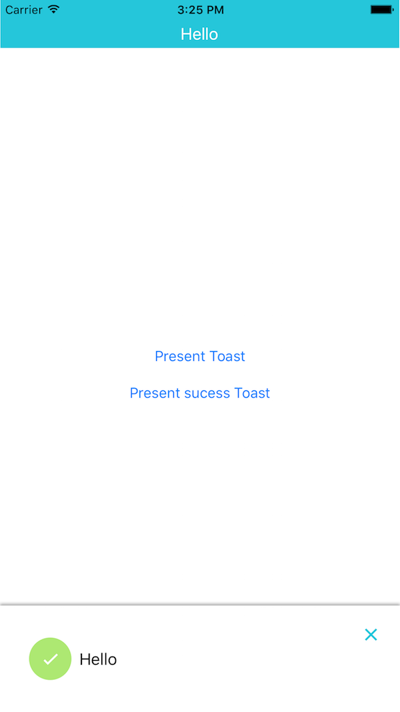

# MaryToastin

[](https://travis-ci.org/leverdeterre/MaryToastin)
[](http://cocoapods.org/pods/MaryToastin)
[](http://cocoapods.org/pods/MaryToastin)
[](http://cocoapods.org/pods/MaryToastin)
#[](https://github.com/leverdeterre/MaryToastin)

## Example

To run the example project, clone the repo, and run `pod install` from the Example directory first.

## Requirements
- Xcode 8
- Cocoapod useFrameworks! / 
- Swift 3

## Installation

MaryToastin is available through [CocoaPods](http://cocoapods.org). 
To install it, simply add the following line to your Podfile:

```ruby
pod "MaryToastin"
```
it has a unique dependency to the fantastic pod [MaryPopin](https://github.com/backelite/MaryPopin) 

## Usage 

```swift
//In your viewController
showNotification(message: "Hello")
showSuccessNotification(message: "Hello")
```



## Author

Jérôme Morissard, morissardj@gmail.com

## License

MaryToastin is available under the MIT license. See the LICENSE file for more info.
